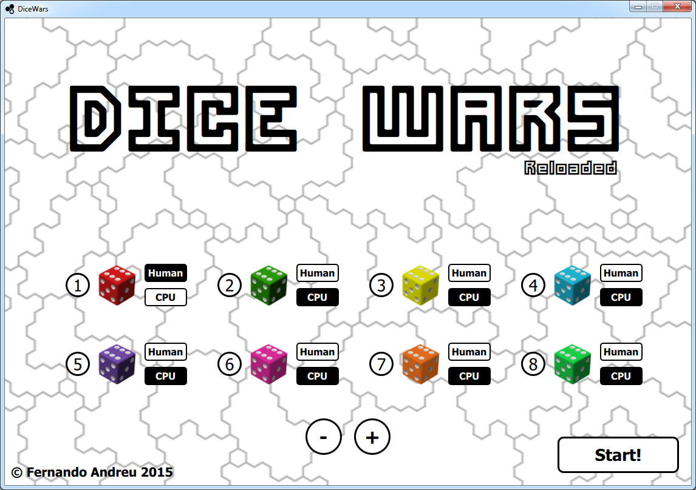
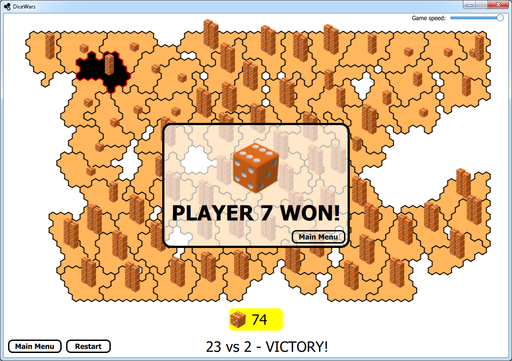

Dice Wars (Reloaded)
--------------------

Dice Wars (Reloaded) is a remake of the [classic Flash game](https://www.gamedesign.jp/flash/dice/dice.html) by [GAMEDESIGN](https://www.gamedesign.jp/) using Qt Quick (C++/QML).

The game was mostly developed in 2015 with Windows Desktop as target platform. Please keep this in mind if attempting to build / run the game in any other untested platform.

How to play
-----------

Select the number of players and whether they will be AI controlled or not. Each player will start in a hexagonal map with a given amount of dice distributed randomly across his territories.

On each turn, a player can attack neighbour territories. The dice on each territory will be thrown to determine the score. If the player succeeds, all the dice but one will move to the attacked territory. If the player fails, all the dice but one will be lost.

At the end of each turn, each player will receive an amount of dice depending on how many connected territories he has. The dice will be distributed randomly across all his territories.

The hexagonal grid is randomly generated by a procedural algorithm that ensures variety and fun on each game. No game will be identical to another.

Build Status
------------

Download
--------

The latest Windows Desktop build is attached to the latest release at the following link:

https://github.com/fernandreu/dice-wars/releases/latest

Screenshots
-----------

