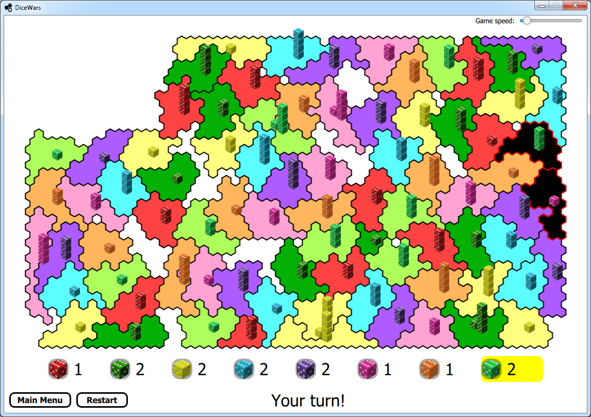
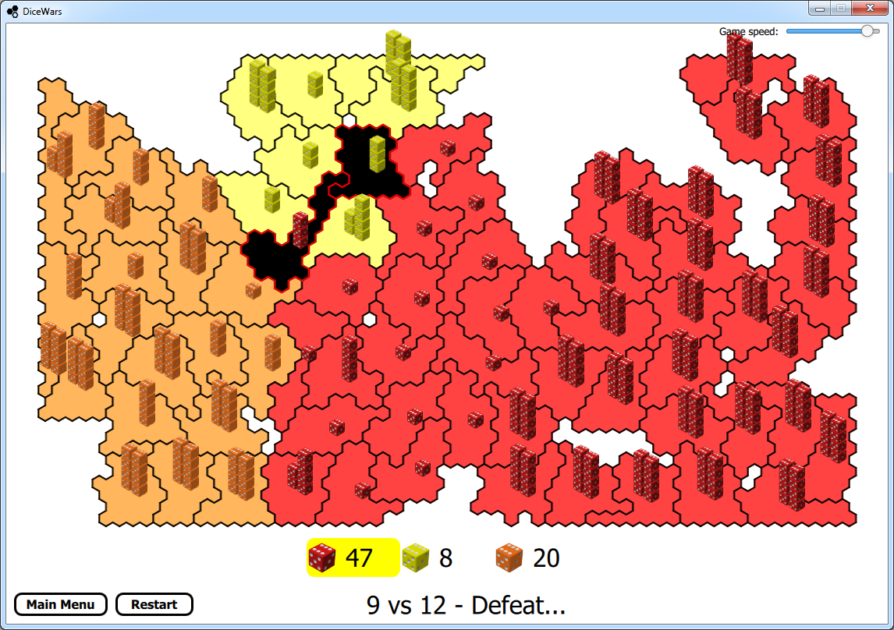

Dice Wars (Reloaded)
--------------------

Dice Wars (Reloaded) is a remake of the [classic Flash game](https://www.gamedesign.jp/flash/dice/dice.html) by [GAMEDESIGN](https://www.gamedesign.jp/) using Qt (C++/QML).

The game was mostly developed in 2015 with Windows Desktop as target platform. Please keep this in mind if attempting to run the game in any other untested platform.

Download
--------

The latest Windows Desktop build is attached to the latest release at the following link:

https://github.com/fernandreu/dice-wars/releases/latest

Screenshots
-----------

